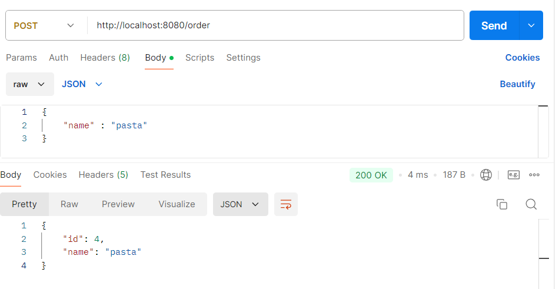

# Обмен сообщениями между сервисами через Kafka
2 микросервиса: Order - принимает заказы от пользователя, Kitchen - получает заказ в работу
## Для запуска приложения необходимо
### 1. Установить локально Kafka https://kafka.apache.org/downloads, например в 'c:\tools'
### 2. Запустить в cmd (с правами администратора), войти в папку с Kafka (например: 'cd C:\tools\kafka_2.12-3.8.0') и выполнить команду 
bin\windows\zookeeper-server-start.bat config\zookeeper.properties 
### 3. В другом cmd в той же папке выполнить 
bin\windows\kafka-server-start.bat config\server.properties
### 4. Запустить оба сервиса - Order и Kitchen
### 5. В Postman отправить Post запрос на 
http://localhost:8080/order
### с JSON в теле(body):
{"name" : "pasta"}

#### При этом сервис Order запишет в базу (H2 для простоты) и вернет order с id. А также отправит объект в Kafka.
#### Получение объкта в сервисе Kitchen можно проконтролировать в консоли
